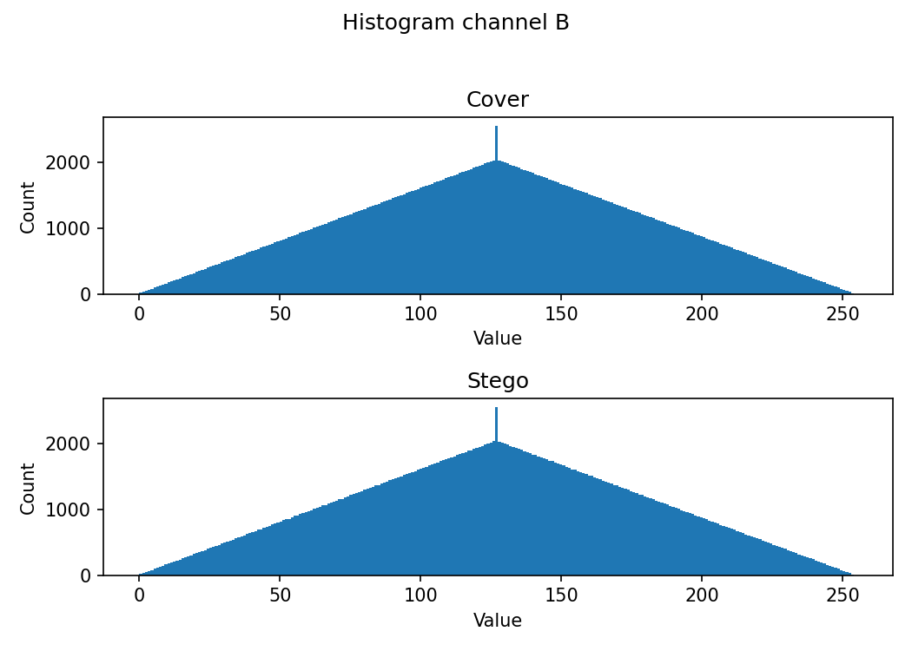
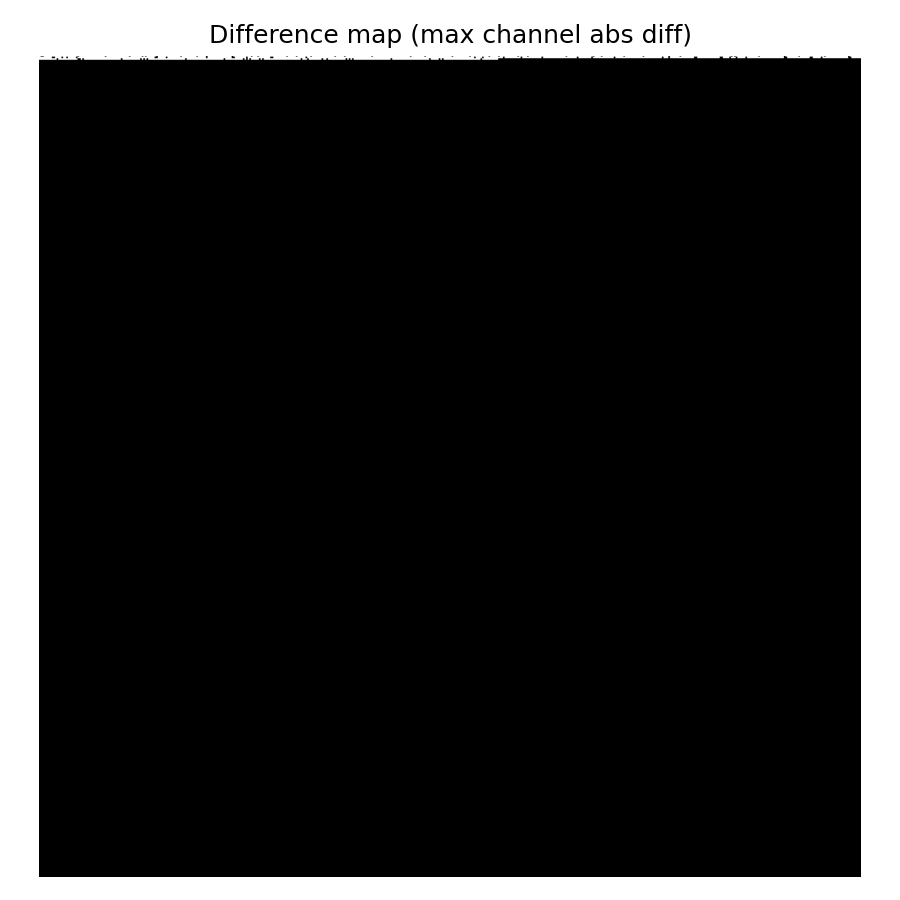
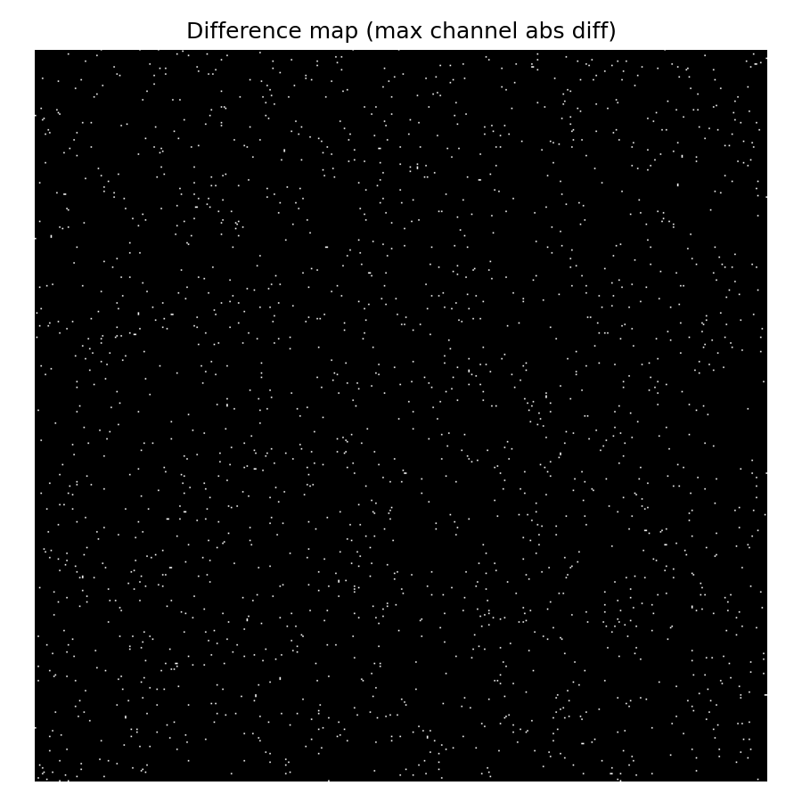
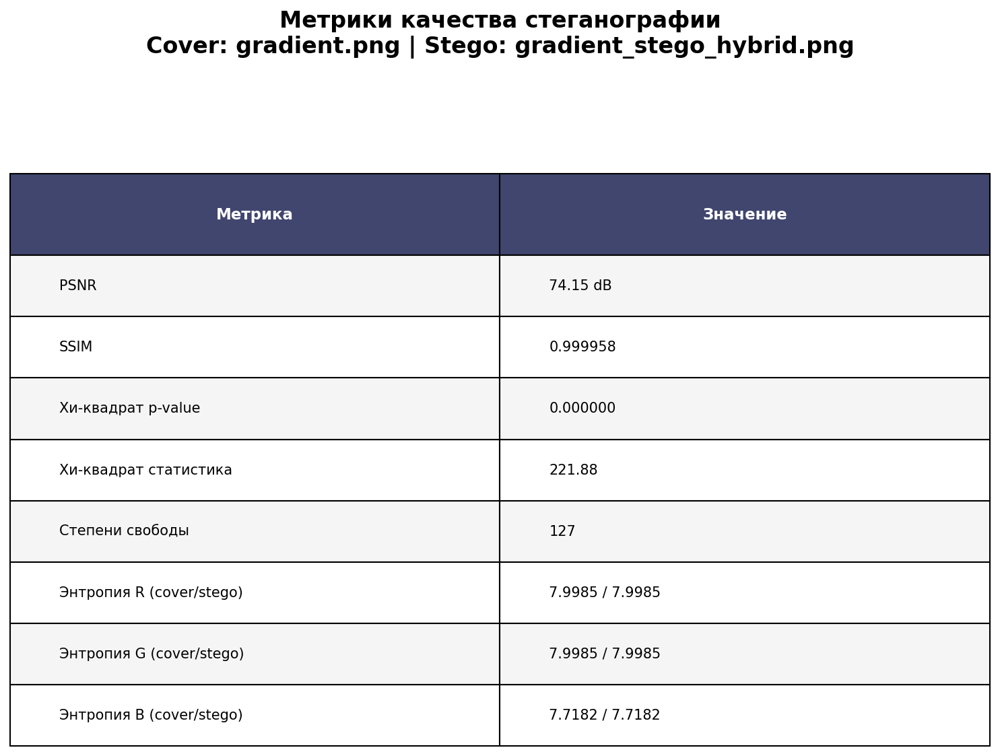

# Лабораторная работа 3
**Гибридная защита: симметричное шифрование + стеганография в изображениях**

## Цель работы 
Необходимо было выполнить и сравнить два метода стеганографии: простой LSB-1 и гибридный (симметричное шифрование сообщения + LSB-1 по случайным пикселям). Ниже будет рассмотрена реализация обоих методов, а также их сравнение на основании метрик.

## Простой LSB-1
Метод был подробно рассмотрен и реализован в [предыдущей лабораторной работе](https://github.com/Senchukovaes/Stego_LSB). Кратко снова по нему пройдёмся.

### Встраивание
Последовательно для каждого байта картинки (в который мы собираемся встроить сообщение) выполняется сначала побитовое **И** с числом **11111110** (обнуляем последний бит байта),
а затем побитовым **ИЛИ** встраивается бит сообщения.
Реализация в коде:
```python
  flat2 = flat.copy()
  mask = np.uint8(0xFE)
  bits_arr = bits.astype(np.uint8)
  # последовательное встраивание
  flat2[:n_bits] = (flat2[:n_bits] & mask) | bits_arr
```

## Извлечение
Для восстановления сообщения мы проводим побитовое **ИЛИ** с числом **00000001** для каждого байта, куда было встроено сообщение, таким образом получая биты исходного сообщения.
Реализация в коде:
```python
    # Извлекаем все биты сообщения
    all_bits = (flat[:total_bits_needed] & 1).astype(np.uint8)
    all_bytes = np.packbits(all_bits).tobytes()
```

## Гибридный LSB
Гибридный метод стеганографии проходит в два этапа:
- Симметричное шифрование исходного сообщения методом **AES-128** (в данной работе был реализован режим CBC)
- Встравание зашифрованного сообщения в певдослучайные позиции пикселей

Пошагово посмотрим реализацию этого метода.

### Генерация ключа
Из пароля, полученного при запуске программы, а также дополнительного параметра **salt** создаём ключ. Преобразуем пароль в байты, делаем конкатенацию с **salt** и берём хэш от этой конкатенации.
```python
def derive_key_iterative(passphrase: str, salt: bytes, iterations=20000, key_len=16):
    # KDF (генерируем ключ из пароля и соли)
    # Преобразуем пароль в байты, берём хеш и снова байты
    h = hashlib.sha256(passphrase.encode() + salt).digest()
    for _ in range(iterations - 1):
        h = hashlib.sha256(h).digest()
    return h[:key_len]
```

### AES шифрование
Следующим шагом исходное сообщение сообщение шифруется при помощи метода симметричного шифрования AES-128 (режим CBC).\
Генерируем **salt** и **IV**. Далее вызываем генерацию ключа при помощи **salt** . Затем шифруем наше сообщение.\
В процессе шифрования сообщение делится на блоки. Первый блок шифруется при помощи **IV**, а каждый последующий блок шифруется при помощи предыдущего.\
Код реализации:
```python
def encrypt_message_bytes(plain: bytes, password: str, kdf_iters=20000):
    salt = SimpleIVGenerator().generate(SALT_LEN)
    iv = SimpleIVGenerator().generate(IV_LEN)
    key = derive_key_iterative(password, salt, iterations=kdf_iters)

    cipher = AES.new(key, AES.MODE_CBC, iv)

    # PKCS#7 padding
    pad_len = 16 - (len(plain) % 16)
    padded = plain + bytes([pad_len] * pad_len)

    ct = cipher.encrypt(padded)
    return build_blob(salt, iv, ct)
```

### Встраивание заголовка
Перед встраиванием сообщения в изображение мы должны добавить в его начало "заголовок" со служебной информацией, при помощи которой сообщение можно будет проверить и корректно расшифровать.\
В данной работе встраивался заголовок следующего содержания:
```
MAGIC = b'HSDG'
VERSION = 1
SALT_LEN = 16
IV_LEN = 16
HEADER_LEN = 4 + 1 + SALT_LEN + IV_LEN + 4
```
- MAGIC - идентификатор формата файла. С помощью него можно определить тип данных, а также проверить целостность данных.
- VERSION - версия формата файла.
- SALT_LEN - длина параметра salt.
- IV_LEN - длина параметра IV.
- HEADER_LEN - длина заголовка.

### Генерация псевдослучайных позиций
Далее необходимо сгенерировать массив всевдослучайных позиций. Для этого был использован генератор псевдослучайных числе **LCG**, который подробнее описан в [первой лабораторной работе](https://github.com/Senchukovaes/CryptoPic).\
Первое значение генерируется на основе пароля, а каждое последующее - на основе предыдущего.\
Поскольку **LCG** сам по себе обладает не очень хорошей рандомизацией, было принято решение дополнительно перемешать массив позиций при помощи алгоритма **Фишера-Йейтса**, который также описан подробнее в первой лабораторной работе.\
Генерация массива псевдослучайных позиций в коде:
```python
def make_prng_positions(total_slots: int, n_bits: int, password: str):
    # Получаем детерминированный seed = SHA256(password)[0:8]
    h = hashlib.sha256(password.encode()).digest()
    seed = int.from_bytes(h[:8], "big")

    # генерируем псевдослучайные числа
    pr = LCGPRNG(seed)

    idxs = list(range(total_slots))
    # Перемешиваем по Фишеру-Йейтсу
    for i in range(total_slots - 1, 0, -1):
        j = pr.next32() % (i + 1)
        idxs[i], idxs[j] = idxs[j], idxs[i]
    return idxs[:n_bits]
```

### Встраивание
Непосредственно встраивание происходит точно также, как в обычном LSB-1 за одним только исключением: теперь биты сообщения встраиваются в байты по псевдослучайным позициям.\
Реализация в коде:
```python
    # генерируем псевдослучайные позиции
    positions = make_prng_positions(total_bytes, n_bits, password)

    flat2 = flat.copy()
    mask = np.uint8(0xFE) #1111110
    for i, pos in enumerate(positions):
        bit = int(bits[i]) # бит из сообщения
        flat2[pos] = (flat2[pos] & mask) | bit
```

### Извлечение
Извлечение (восстановление сообщения) происходит в обратном порядке и также требует пароля от пользователя. Пароль должен быть такой же, какой был использован при встраивании.\
Сообщение побитово извлекается из тех же самых случайных позиций. Затем извлекается заголовок, при помощи которого можно проверить целостность информации, а также получить все необходимые для расшифровки параметры.
После этого расшифровывается само сообщение.

## Метрики и сравнение
Для того, чтобы проанализировать и сравнить между собой оба метода, для обоих методов были расчитаны следующие метрики:
- Гистограммы
- Карты разности
- PSNR
- SSIM
- Хи-квадрат
- Энтропия

Все вышеперечисленные метрики были подробно рассмотрены в предыдущих лабораторных работах, так что сейчас акцент будет сделан именно на сравнении методов на основании результатов метрик.

### Гистограммы
Гистограммы для cover и stego изображений практически не отличаются друг от друга для обоих методов, потому что при реализации обоих методов визуальные изменения картинки остаются незначительными.\
В качестве примера посмотрим гистограммы синего канала для градиента.
#### Простой LSB-1

#### Гибридный LSB


### Карты разности
На картах разности можно чётко увидеть различие: очень хорошо и наглядно видно, что при простом LSB-1 сообщение встраивается в пиксели по порядку, а при гибридном LSB - в случайные пиксели картинки.\
Чтобы убедиться в этом также посмотрим на карты разности для градиента:
#### Простой LSB-1

#### Гибридный LSB


### Остальные метрики
Посмотрим на результирующую таблицу вычисления метрик для всё того же градиента.
#### Простой LSB-1

#### Гибридный LSB


Такие метрики как **PSNR** и **SSIM** могут показать незаметность каждого метода в частности, но от метода к методу они практически не меняются, так как при реализации как первого метода, так и второго, изображение практически
не изменяет свою структуру и сильно зашумлённым не становится.\
А вот метрика **хи-квадрат** гораздо менее устойчива ко второму методу. Если простой LSB-1 обнаружить может быть просто, так как биты сообщения встраиваются подряд, и подозрительное распределение младших битов 
заметить на таком отрезке легче, то гибридный LSB в этом плане гораздо более устойчивый: биты сообщения встраиваются в рандомные позиции и заметить что-то неладное в распределении младших битов становится значительно сложнее.

## Вывод
На основании проделанной работы можно сделать вывод, что гибридый метод встраивания гораздо более надёжный, поскольку его тяжелее обнаружить.
